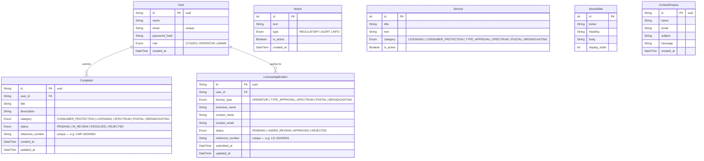

# BOCRA Database — Entity Relationship Diagram



---

## Relationship Summary

| Relationship | Type | Description |
|---|---|---|
| User → Complaint | One-to-Many | A user can submit many complaints |
| User → LicenseApplication | One-to-Many | A user can submit many licence applications |
| Notice | Standalone | Seeded content, no FK |
| Service | Standalone | Seeded content, no FK |
| AboutSlide | Standalone | Seeded content, no FK |
| ContactEnquiry | Standalone | Public submissions, no user FK |

---

## Enum Reference

### User.role
| Value | Description |
|---|---|
| `CITIZEN` | General public user |
| `OPERATOR` | Licensed telecom/broadcast operator |
| `ADMIN` | BOCRA staff — full access |

### Complaint.category
| Value |
|---|
| `CONSUMER_PROTECTION` |
| `LICENSING` |
| `SPECTRUM` |
| `POSTAL` |
| `BROADCASTING` |

### Complaint.status
| Value | Meaning |
|---|---|
| `PENDING` | Submitted, not yet reviewed |
| `IN_REVIEW` | Assigned to a BOCRA officer |
| `RESOLVED` | Complaint closed successfully |
| `REJECTED` | Complaint not upheld |

### LicenseApplication.license_type
| Value |
|---|
| `OPERATOR` |
| `TYPE_APPROVAL` |
| `SPECTRUM` |
| `POSTAL` |
| `BROADCASTING` |

### LicenseApplication.status
| Value | Meaning |
|---|---|
| `PENDING` | Submitted, awaiting review |
| `UNDER_REVIEW` | Being assessed |
| `APPROVED` | Licence granted |
| `REJECTED` | Application denied |

### Notice.type
| Value | Meaning |
|---|---|
| `REGULATORY` | Official regulatory update |
| `ALERT` | Urgent public notice |
| `INFO` | General information |
```
